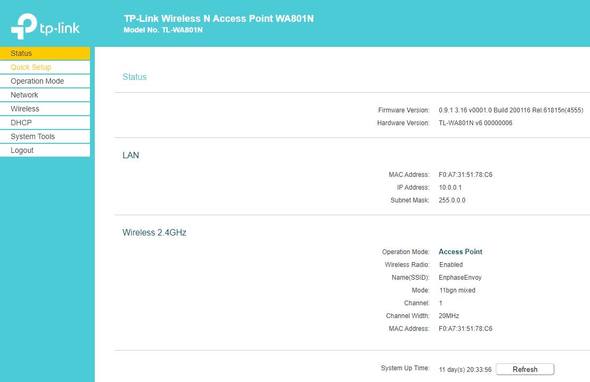
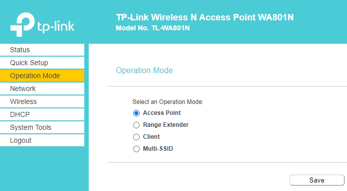
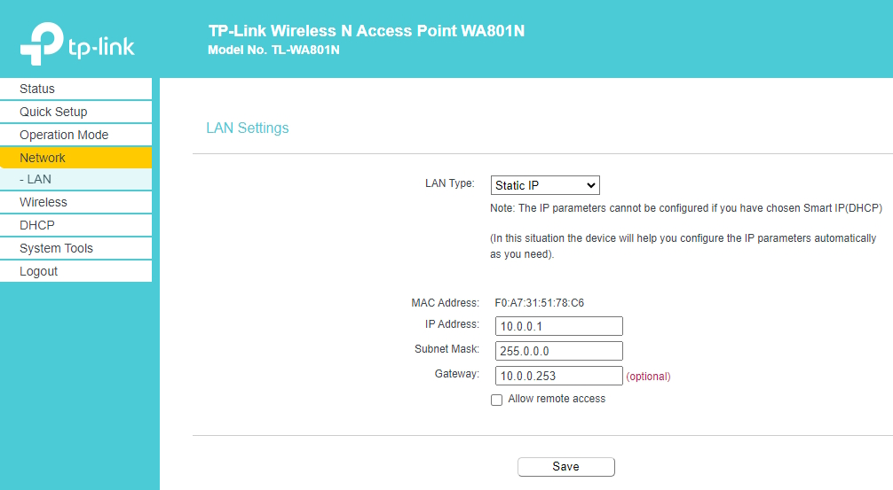
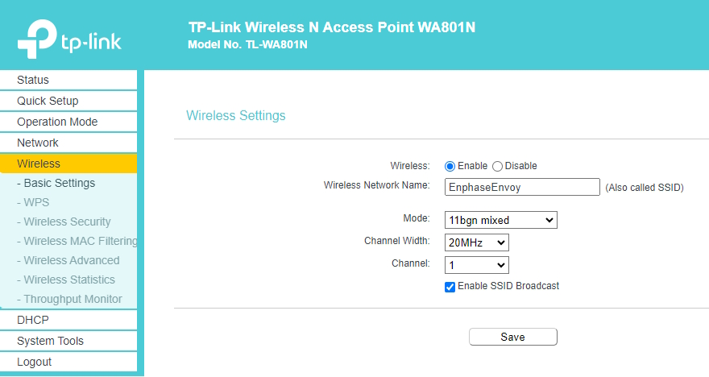
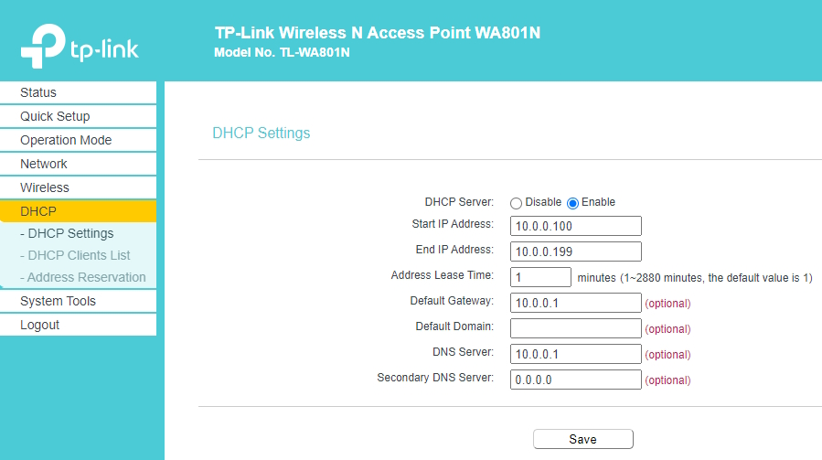
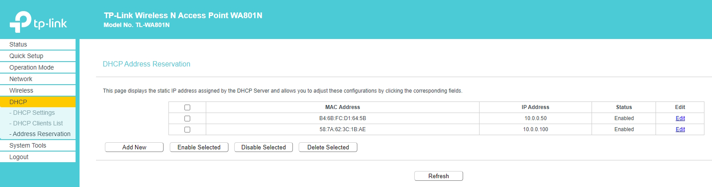

# Isolating an Envoy from the Internet

The usual setup of an Envoy has a connection to the Internet.
At regular intervals, the Envoy connects to enphase.com and uploads all the data gathered.
This also allows Enphase to push software updates.

This EnvoyToolkit allows you to monitor, gather the data and produce reports locally.
To prevent the uploading of your data and software updates, the Envoy needs to be disconnected form the Internet.

## Assumptions

*	These instructions address the case where your Envoy has a wireless connection to your local network.
You will need to adapt them accordingly if your Envoy has an Ethernet connection.

*	Your local network is the class C 192.168.1.x

*	The PC you'll use to monitor the Envoy has only a single network connection to 192.168.1.x

## Network setup

You'll need a separate network adapter and a wireless access point.
I used an [Asus USB-C2500][1] and a [tp-link TL-WA801N][2].

*	Connect the Asus to a USB port on the PC.

*	Connect the tp-link to the Asus ethernet connection.

*	Create a new wireless class A subnet 10.0.0.x. on the tp-link:

I named the network EnphaseEnvoy.

Notice that 10.0.0.253 points nowhere; hosts on this network are isolated.

The default gateway is the tp-link itself, i.e. nowhere.

The Envoy's MAC address is hard-wired to 10.0.0.100.
Open the image in a new tab if it's hard to read.

## Envoy configuration

Follow [these instructions][3] to connect the Envoy to the EnphaseEnvoy wireless network.
It should get the IP address 10.0.0.100. 

**Tip**: The Envoy's wireless isn't very strong. 
If you have several wireless networks, they might interfere with each other if you 
haven't setup the wireless channels so that they don't overlap.
Whilst you're doing the setup, **put the tp-link close to the Envoy**.

## Testing

On your PC, run envoymonitor.exe from the command line.

Check the log file in My Documents\Envoy.

Run EnvoyMonitor.exe as a service on your PC. The log file will be in C:\Envoy.

[1]: https://www.asus.com/ch-en/networking-iot-servers/wired-networking/wired-adapters/usb-c2500/
[2]: https://www.tp-link.com/uk/home-networking/access-point/tl-wa801n/
[3]: https://support.enphase.com/s/article/Reconnecting-your-Envoy-ManualWifi

