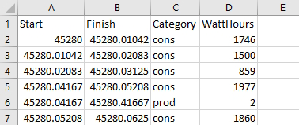
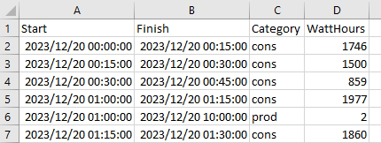

# Reporting with EnvoyReporter

EnvoyReporter.exe has the following command-line parameters:

```
  -s, --start       Start date YYYY-MM-DD. Defaults to yesterday

  -f, --finish      Start date YYYY-MM-DD. Defaults to midnight yesterday

  -c, --config      (Default: configuration.json) Configuration JSON file.
                    Defaults to configuration.json

  -g, --grouping    Sets how readings are summed: hourly, daily or monthly. Defaults
                    to hourly

  -d, --days        Plot N previous days

  -m, --months      Plot N previous months

  -y, --years       Plot N previous years

  -o, --output      (Default: email) Any combination of: email, image, csv. Defaults to
                    email

  -p, --plot        (Default: 1024,768) Image size, defaults to 1024,768

  --help            Display this help screen.

  --version         Display version information.

```

All the parameters are optional and default to producing an hourly report for yesterday and sending it by email.

## Output
Specify any combination of **email**, **image** and **csv**. By default, email.

## Grouping

The raw data is in watt/hours, at whatever frequency you set with **Interval** in the configuration.
The values are summed, hourly, daily or monthly with the **--grouping** parameter.
It defaults to **hourly**, **daily** and **monthly** for --days, --months and --years respectively
if any of them are present.

## Period to plot

Specify --start and/or --finish for a specific period. If you specify only --start, --finish defaults to 24 hours later.
If you specify only --finish, --start defaults to 24 hours earlier.

Combine --start **or** --finish with grouping

>	EnvoyReporter.exe --finish 2023-07-01 --days 30 --grouping daily

will produce a report for June 2023 with values summed by day.

>	EnvoyReporter.exe --s 2023-06-01 --f 2023-07-01 --g daily

will produce the same thing.

## Saving plots 

Specify **--output image** to write the chart as a JPG. Use the --plot parameter to set the size.

## Saving raw data to a CSV

Specify **--output csv** to write the raw data used to build the chart as a CSV file.

The start and finish fields in the CSV are in OLE Automation date format, i.e. an Excel date serial.
An OLE Automation date is implemented as a floating-point number whose integral component is the number 
of days before or after midnight, 30 December 1899, and whose fractional component represents the time 
on that day divided by 24.

The Category field is **prod** for production and **cons** for consumption, to make cross-tabs a breeze.

The watthours field is, unsurprisingly, the number of watt hours during the period from start to finish,
rounded to the nearest integer; when we're talking megawatts, milliwatts are irrelevant.

When you open the CSV with Excel:



The dates are not intuitive. Format the first two columns with a custom format **yyyy/mm/dd hh:mm** and things become clearer:



## Output folder

Files written by EnvoyReporter or EnvoyGUI will be in **My Documents\EnphaseEnvoy**.

