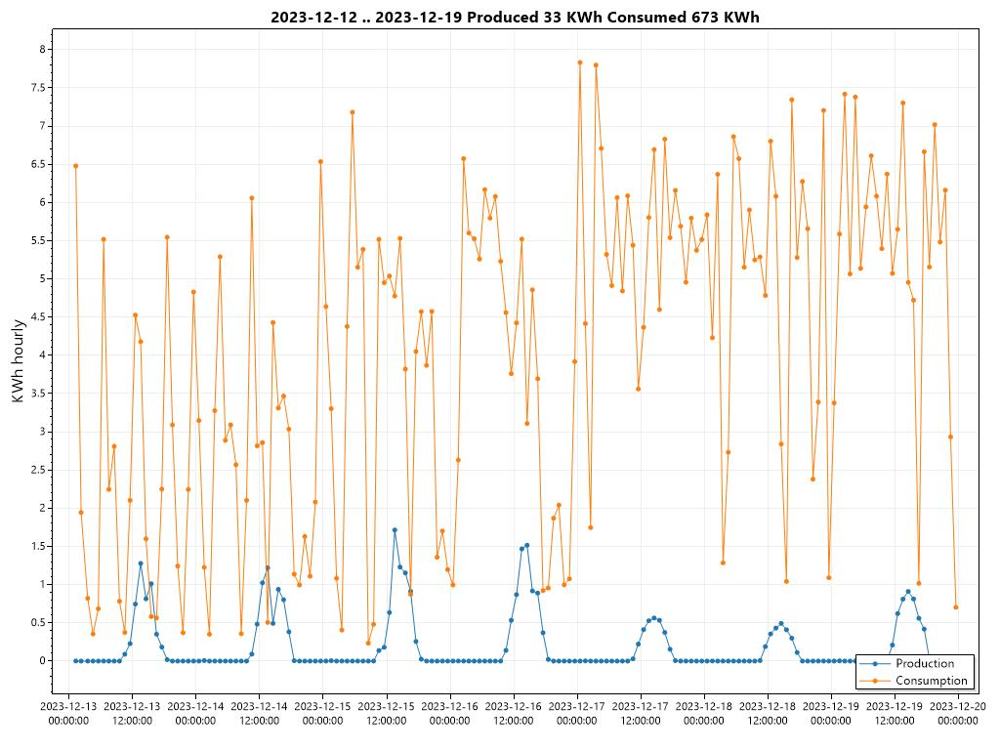
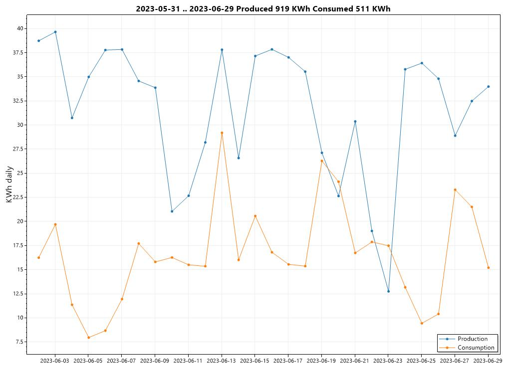
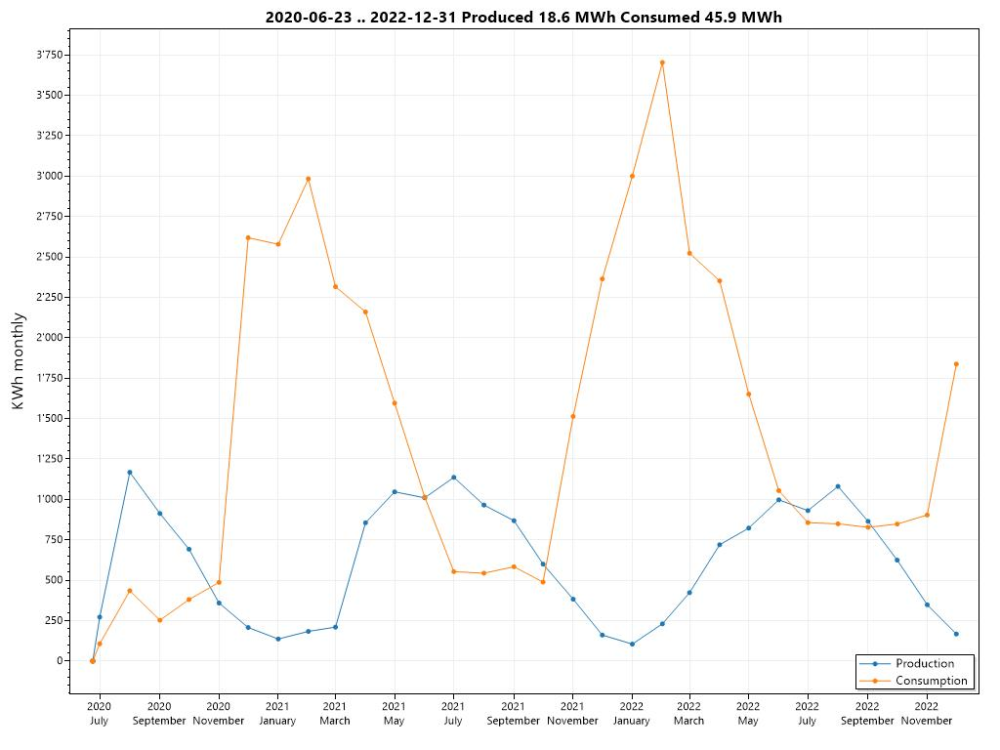
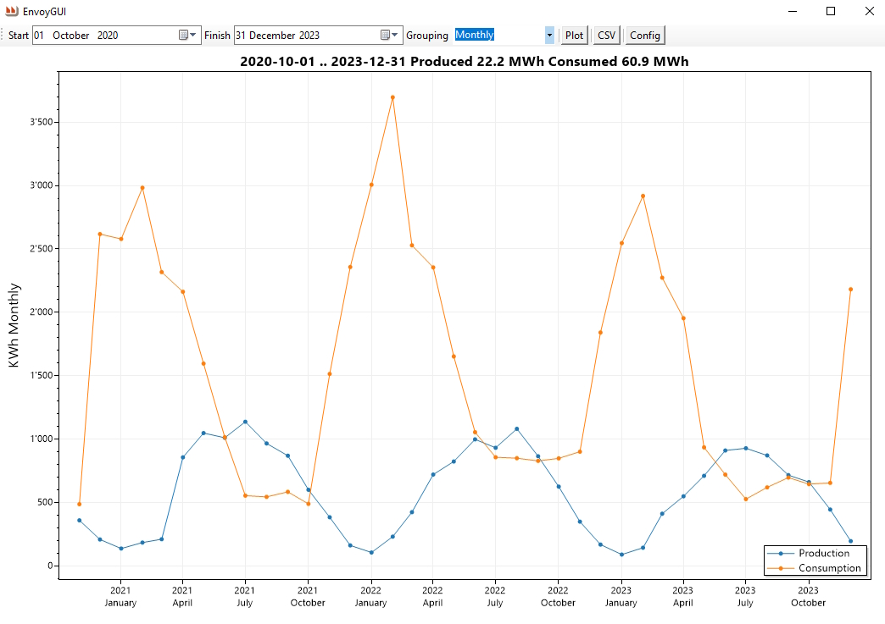

# EnvoyToolkit

Monitors an [Enphase Envoy][7] and inverters locally, producing reports of electricity production and consumption.

If desired, it can run autonomously on a LAN with no Internet connectivity.
Instructions to setup your Envoy on an isolated subnet to prevent it from uploading your data or receiving unwanted software updates
can be found [here][10].

## Features

*	Automatic Email reports, with charts

*	Email warnings for failed inverters

*	Raw data extract to CSV

*	Charts can be produced for any arbitrary period, start-to-finish or the N preceding days/months/years:

### Hourly



A week in December. Feeble production in the middle of the day, increasingly high consumption by the heat pump as the weather cools.

### Daily



The month of June. Plentiful production, low consumption. It rained all day on the 23rd of June.

### Monthly



Nearly three years. Summer and winter show up clearly. Februarys are bitterly cold.

## Prerequisites

You will need:

*	An [Enphase Envoy][7], connected to your local network

*	Any old PC running Windows 7 or later, running 24/7

*	A PC (possibly the same one) running Microsoft SQL Server. The free express edition is fine.  Get it [here][6]

*	An SMTP provider so that you can send emails. Google provides this for free, see *Send email with the Gmail SMTP server* [here][5].

*	SQL Server Management Studio, to restore the supplied database and maintenance. Get it [here][3]

*	Optionally, if you want to compile from source, Visual Studio 2022. The free community edition is fine. Get it [here][4]

## Installing

*	On the 24/7 PC, download the repository and install EnvoyToolkit.msi. It will install to  
	**C:\Program Files(x86)\EnvoyToolkit\EnvoyToolkit**

*	Restore **Enphase.bak** from the Assets folder to the database **Enphase** on your SQL Server.  
	It contains a few years' data which you can use to play with the reporting, with EnvoyGUI.exe.
	
*	Setup an email account with your SMTP provider, for example 'Envoy Agent' `envoy@mydomain.com`.

*	Describe your configuration by editing configuration.json. Instructions [here][1]

## Monitoring

Setup EnvoyMonitor.exe to as a service. Open an administrative command-line and :
```
sc.exe create EnvoyMonitor start=delayed-auto binpath="C:\Program Files (x86)\EnvoyToolkit\EnvoyToolkit\envoymonitor.exe"
sc.exe description EnvoyMonitor "Monitors Envoy power and inverters"
sc.exe start EnvoyMonitor
```
It will write log files to C:\Envoy

## Inverters

EnvoyMonitor.exe checks the inverters every time it reads the meters.

When an inverter hasn't communicated for 24 hours it sends an email and logs the event.
It keeps sending an email every 24 hours thereafter until the inverter is resuscitated.

When you remove an inverter, restart EnvoyMonitor.exe service to reload the configuration.

## Reporting

Use EnvoyGUI.exe to play with the data:



Use EnvoyReporter.exe to build and send reports automatically.  Instructions [here][2]

## Logging

The programs all generate log files, one per day, to track activities and resolve problems.

Logs written by EnvoyGUI.exe and EnvoyReporter.exe will be in **My Documents\Envoy**.

Logs written by EnvoyMonitor.exe service will be in **C:\Envoy**.

They are cleaned up automatically, keeping the previous 10 days.

### EnvoyMonitor log sample

```
2023-12-20 10:58:41 INFO EnvoyMonitor is starting 
2023-12-20 10:58:41 INFO Creating default userid and password for Envoy. 
2023-12-20 10:58:41 INFO See https://enphaseenergy.com/sites/default/files/downloads/support/IQ-Envoy-Manual-EN-US-07-14-2020b.pdf page 29 
2023-12-20 10:58:43 INFO Envoy at http://192.168.1.4 serial number = 123456789 
	part number = 111-22222-r03 software = R5.0.55 inverters = 33 
2023-12-20 10:58:43 INFO Configuration: 
2023-12-20 10:58:43 INFO   Database = Enphase 
2023-12-20 10:58:43 INFO   EmailFrom = enphase@company.com 
2023-12-20 10:58:43 INFO   EmailTo = user@company.com 
2023-12-20 10:58:43 INFO   Envoy = 123456789 
2023-12-20 10:58:43 INFO   EnvoyAddress = http://10.0.0.100 
2023-12-20 10:58:43 INFO   EnvoyPassword = last-six-digits-of-serial-number 
2023-12-20 10:58:43 INFO   EnvoyUserID = secret 
2023-12-20 10:58:43 INFO   Interval = 01:00:00 
2023-12-20 10:58:43 INFO   NameFrom = User Name  
2023-12-20 10:58:43 INFO   NameTo = User Name 
2023-12-20 10:58:43 INFO   QueryInfo = info.xml 
2023-12-20 10:58:43 INFO   QueryInventory = inventory.json 
2023-12-20 10:58:43 INFO   QueryMeter = production.json?details=1 
2023-12-20 10:58:43 INFO   SMTPPort = 587 
2023-12-20 10:58:43 INFO   SMTPServer = mail.company.com 
2023-12-20 10:58:43 INFO   SMTPUser = enphase@company.com 
2023-12-20 10:58:43 INFO   SMTPPassword = secret 
2023-12-20 10:58:43 INFO   SQLPassword = secret 
2023-12-20 10:58:43 INFO   SQLServer = (local) 
2023-12-20 10:58:43 INFO   SQLUserID = secret 
2023-12-20 10:58:45 DEBUG ReadMeters Production lifetime 25.2 MWh today 5 KWh 
	Consumption lifetime 62.8 MWh today 67 KWh
2023-12-20 10:58:45 DEBUG Snoozing for 75 seconds 
```

### EnvoyReporter log sample

```
2023-12-20 23:04:30 INFO EnvoyReporter is starting with 
	Start = 0001-01-01 00:00:00 Finish = 0001-01-01 00:00:00 Config = ..\..\..\..\configuration.json 
	Grouping = [omitted] Days = 0 Months = 0 Years = 0 Output = image Plot = 1024,768  

... the same configuration blurb as above

2023-12-20 23:04:33 INFO Adjusted start 2023-12-19 00:00:00+01:00 +01:00 
	finish 2023-12-20 00:00:00+01:00 +01:00 grouping hourly 
2023-12-20 23:04:34 INFO Wrote chart D:\Documents\EnphaseEnvoy\20231220_230430.jpg 
```

## Dates, times and UTC

**N.B. Dates and times are always expressed in ISO8601 format YYYY-MM-DD HH:MM.SS**

The meter readings's timestamps are made using the clock of the PC running EnvoyMonitor.exe, converted to UTC. 
The datetime of the Envoy is ignored; if you have wisely disconnected it from the Internet, 
its datetime may be faulty because it can't access a time server. We don't care.

The dates and times in the SQL database are all in UTC *translated from the local time of reading* because u
sing local times would make meter readings overlap when changing between summertime and wintertime.

The dates and times that you supply to EnvoyReporter.exe are all in local time, the conversions are
 made automatically. When you use the CSV option, the datetimes are local **at the moment that you create the report**. 
In other words, the report you create for June in July will differ slightly from the report that 
you create for June in December (assuming that you have daylight saving time that switches in spring and autumn). All this hinges on your current timezone.

This might appear counter-intuitive, but it makes sense when you think about it.

## Dependencies

These are here because it is good practice. You may ignore them.

CommandLineParser  
Config&period;Net  
MailKit  
Microsoft.Bcl.AsyncInterfaces  
Microsoft.CSharp  
Microsoft.EntityFrameworkCore.SqlServer  
Microsoft.Extensions.Configuration  
Microsoft.Extensions.Hosting  
MimeKit  
Newtonsoft.Json  
NLog  
ScottPlot  
System.DirectoryServices  
System.Drawing.Common  
System.Security.Permissions  
System.ServiceModel.Duplex  
System.ServiceModel.Federation  
System.ServiceModel.NetTcp  
System.ServiceModel.Security  

## Author

Maurice Calvert

 <- This is a picture, to fool bots >;-)

## Version History

* 1.0.0
    * Initial Release

## License

This project is licensed under the GNU V3 License - see the LICENSE.txt file for details

[1]: assets/configuring.md
[2]: assets/reporting.md
[3]: https://learn.microsoft.com/en-us/sql/ssms/download-sql-server-management-studio-ssms?view=sql-server-ver16
[4]: https://visualstudio.microsoft.com/downloads/
[5]: https://support.google.com/a/answer/176600?hl=en
[6]: https://www.microsoft.com/en-us/sql-server/sql-server-downloads
[7]: https://enphase.com/installers/communication
[8]: https://learn.microsoft.com/en-us/windows/win32/taskschd/task-scheduler-start-page
[9]: https://learn.microsoft.com/en-us/troubleshoot/windows-client/deployment/create-user-defined-service
[10]: assets/isolating.md
